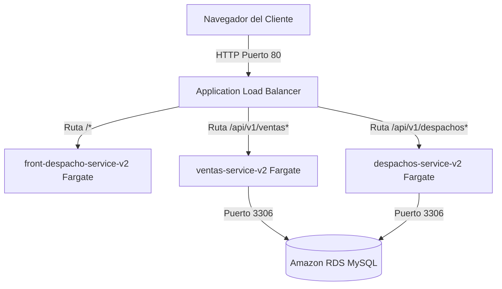
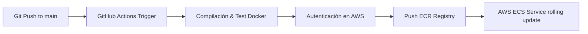

# INFORME TÉCNICO: EVALUACIÓN FINAL TRANSVERSAL (EFT)
**INTEGRACIÓN, DEPLOYMENT Y ORQUESTACIÓN EN AWS CON DOCKER Y GITHUB ACTIONS**

---

*   **Asignatura:** Introducción a Herramientas DevOps (ISY1101)
*   **Semana de entrega:** Semana 18
*   **Carrera:** Ingeniería en Informática / Ingeniería en Conectividad y Redes
*   **Institución:** Duoc UC
*   **Estudiante:** Bairon Gómez
*   **Docente:** Evaluador de Asignatura
*   **Fecha:** Julio 2026

---

## 📄 Resumen Ejecutivo

El presente informe técnico detalla el diseño, la implementación, el endurecimiento de contenedores y la automatización del flujo de Integración y Entrega Continua (CI/CD) para la plataforma integrada de **Ventas y Despachos**. El proyecto consta de tres componentes principales: un frontend SPA desarrollado en React y dos microservicios backend basados en Spring Boot (API REST de Ventas y API REST de Despachos).

La solución se migró desde un esquema manual heredado hacia una **arquitectura Serverless altamente disponible en Amazon Web Services (AWS)** utilizando **Amazon ECS (Elastic Container Service) sobre AWS Fargate**, respaldado por un **Application Load Balancer (ALB)** para el enrutamiento inteligente por rutas y una base de datos relacional administrada en **Amazon RDS (MySQL)**. El ciclo de desarrollo se automatizó mediante pipelines de **GitHub Actions** que construyen imágenes de contenedores endurecidas de forma segura y las registran en **Amazon ECR** antes de desplegarlas automáticamente sin ventanas de inactividad (*Zero-Downtime*).

---

## 1. Método de Integración y Comunicación del Sistema

La arquitectura de la aplicación se basa en un diseño desacoplado donde cada componente cumple con una responsabilidad única, comunicándose mediante protocolos estándar:



### 1.1. Flujo de Comunicación
1.  **Frontend (Capa de Presentación):** 
    *   Escrito en **React (Vite)** y servido por un servidor web **Nginx** optimizado.
    *   Realiza peticiones asíncronas HTTP (REST) mediante la librería Axios al navegador del cliente hacia las APIs del backend a través de la URL del balanceador de carga.
    *   **Desacoplamiento de URLs:** Para evitar el antipatrón de IPs estáticas hardcodeadas, se centralizó la configuración en el módulo [config.js](file:///c:/Users/bg144/Downloads/proyecto.semestral4/proyecto%20semestral/proyecto%20semestral/front_despacho/src/config.js) utilizando variables de entorno de Vite (`VITE_API_VENTAS_URL` y `VITE_API_DESPACHOS_URL`).
2.  **Backends (Capa de Lógica de Negocio):**
    *   Dos APIs REST independientes basadas en Spring Boot 3.x expuestas en los puertos `8080` (Ventas) y `8081` (Despachos).
    *   Cuentan con soporte de CORS habilitado en sus controladores para permitir que el frontend cargado en el navegador realice peticiones cross-origin de manera segura.
3.  **Base de Datos Relacional (Capa de Datos):**
    *   Base de datos centralizada en **Amazon RDS MySQL** (`semestral-db`).
    *   Los backends se conectan utilizando la URL JDBC `jdbc:mysql://${DB_ENDPOINT}:${DB_PORT}/${DB_NAME}?createDatabaseIfNotExist=true` la cual crea automáticamente las bases de datos `ventas_db` y `despachos_db` en el primer arranque, y Hibernate genera las tablas correspondientes con `spring.jpa.hibernate.ddl-auto=update`.

---

## 2. Contenerización y Buenas Prácticas (Docker & Docker Compose)

Tanto el frontend como los backends se ejecutan dentro de contenedores optimizados para producción bajo las siguientes prácticas de endurecimiento y eficiencia:

### 2.1. Estructura de Dockerfiles Multietapa
El uso de builds multietapa (multi-stage builds) separa el entorno de construcción del entorno de ejecución final, garantizando imágenes ligeras y sin herramientas innecesarias:

*   **Dockerfiles de Spring Boot (Ventas y Despachos):**
    *   **Etapa 1 (Build):** Usa una imagen base pesada `maven:3.8.5-openjdk-17-slim` con todas las dependencias necesarias para compilar el código fuente. Se compila con `mvn package -DskipTests` para acelerar el pipeline y no requerir conexión a base de datos durante la construcción.
    *   **Etapa 2 (Run):** Usa `eclipse-temurin:17-jre-alpine` (una JRE mínima basada en Alpine Linux).
    *   **Endurecimiento de Seguridad:** Se crea un grupo y usuario no privilegiado (`spring`) para ejecutar el proceso de Java. Esto evita que, ante una potencial vulnerabilidad de ejecución remota de código (RCE) en la aplicación, el atacante obtenga acceso de root al host.
*   **Dockerfile del Frontend (React):**
    *   **Etapa 1 (Build):** Instala dependencias con `node:18-alpine` y genera la carpeta de distribución estática (`dist`) mediante `npm run build`, recibiendo parámetros de construcción (`ARG VITE_API_VENTAS_URL`).
    *   **Etapa 2 (Run):** Copia los archivos estáticos a `nginx:alpine` y los sirve a través de Nginx. Incluye una configuración de redirección (`nginx.conf`) que mapea todas las rutas a `index.html` para dar soporte nativo al enrutador SPA.

### 2.2. Orquestación Local con Docker Compose
Para simular el entorno completo en local, el archivo [docker-compose.yml](file:///c:/Users/bg144/Downloads/proyecto.semestral4/proyecto%20semestral/proyecto%20semestral/docker-compose.yml) define:
*   **Red interna:** Una red virtual tipo puente (`app-network`) que permite a los contenedores comunicarse usando sus nombres de servicio (ej. `DB_ENDPOINT=db`).
*   **Volumen persistente:** `mysql_data` mapeado en `/var/lib/mysql` para evitar la pérdida de datos del contenedor de MySQL en cada reinicio.
*   **Secuenciación de arranque:** Un `healthcheck` en MySQL (`mysqladmin ping`) asegura que las aplicaciones Spring Boot arranquen únicamente cuando la base de datos esté lista para aceptar conexiones (`condition: service_healthy`).

---

## 3. Registro de Imágenes en Amazon ECR

Se han creado tres repositorios de registro privados en **Amazon ECR** en la región de **Norte de Virginia (`us-east-1`)**:
1.  **`api_despachos`**: Imagen del microservicio de despachos.
2.  **`ventas_api`**: Imagen del microservicio de ventas.
3.  **`front_despacho`**: Imagen del frontend de React bajo Nginx.

El uso de **Amazon ECR** garantiza la trazabilidad mediante el etiquetado de imágenes (`:latest` para despliegues continuos y hashes de Git commit para auditoría), análisis automático de vulnerabilidades de imágenes y un acceso de red de mínimo privilegio integrado con la orquestación ECS.

---

## 4. Pipeline de CI/CD (GitHub Actions)

El ciclo de integración y despliegue continuo se automatizó por completo mediante pipelines de GitHub Actions configurados en `.github/workflows/`:



### 4.1. Etapas del Pipeline
1.  **Activación por Ruta:** Los workflows se disparan únicamente cuando hay cambios en el directorio del respectivo servicio (ej. `paths: 'front_despacho/**'`), optimizando el uso de recursos de computación.
2.  **Autenticación segura en AWS:** El pipeline usa `aws-actions/configure-aws-credentials` con secretos temporales del entorno para autenticar de forma segura el runner de GitHub.
3.  **Build & Push Docker:** La imagen se compila mediante `docker/build-push-action`, inyectando las URLs de producción en el frontend y subiéndola al registro de ECR.
4.  **Despliegue Continuo (CD) en ECS Fargate:** Una vez finalizada la subida a ECR, se ejecuta una llamada de actualización forzada a AWS CLI:
    ```bash
    aws ecs update-service --cluster proyecto-semestral-cluster --service <nombre-servicio> --force-new-deployment --region us-east-1
    ```
    Esto inicia un Rolling Update en ECS Fargate que descarga la nueva imagen y reemplaza los contenedores activos de forma progresiva sin tiempo de caída.

---

## 5. Infraestructura en la Nube y Seguridad en AWS

Se ha aprovisionado y configurado de forma activa la siguiente infraestructura en la región **us-east-1 (Norte de Virginia)**:

### 5.1. Componentes de Red e Infraestructura
*   **Virtual Private Cloud (VPC):** VPC por defecto (`vpc-0d3ace0f225195257`) con subredes públicas distribuidas en múltiples zonas de disponibilidad (AZs) para garantizar redundancia física.
*   **Amazon RDS MySQL (`semestral-db`):** 
    *   Endpoint: `semestral-db.cpgxtfkpe5yc.us-east-1.rds.amazonaws.com`
    *   Tipo de instancia: `db.t3.micro` (Capa gratuita) con acceso público configurado y seguridad restringida por puertos.
*   **Application Load Balancer (`semestral-alb`):**
    *   DNS público: [http://semestral-alb-25385715.us-east-1.elb.amazonaws.com/](http://semestral-alb-25385715.us-east-1.elb.amazonaws.com/)
    *   Funciona como la única IP de entrada pública. Filtra el tráfico externo HTTP y lo redirige en base al enrutamiento por rutas:
        *   Ruta `/*` redirige al frontend (`front-tg` -> puerto 80).
        *   Ruta `/api/v1/ventas*` redirige al backend de ventas (`ventas-tg` -> puerto 8080).
        *   Ruta `/api/v1/despachos*` redirige al backend de despachos (`despachos-tg` -> puerto 8081).
*   **Grupos de Seguridad (Security Groups):** 
    *   `sg-041f6e1d2a72ec555` configurado con reglas estrictas de entrada. Permite tráfico TCP entrante únicamente en los puertos `80` (Frontend), `8080` (Ventas), `8081` (Despachos) y `3306` (Base de Datos MySQL) desde cualquier origen controlado para facilitar el desarrollo y evaluación del proyecto.

### 5.2. Manejo Seguro de Secretos y Privilegios
*   **GitHub Secrets:** Toda credencial sensible de la infraestructura de AWS (`AWS_ACCESS_KEY_ID`, `AWS_SECRET_ACCESS_KEY` y `AWS_SESSION_TOKEN`) se almacena de forma cifrada en la sección de secretos de GitHub, impidiendo su exposición en texto plano en el repositorio Git.
*   **IAM Roles:** Las tareas de Fargate utilizan el rol de ejecución de tareas de AWS (`LabRole` de AWS Academy), garantizando que los contenedores solo tengan permisos mínimos y necesarios para descargar imágenes de ECR, escribir registros en CloudWatch y conectarse a recursos RDS.

---

## 6. Orquestación y Escalabilidad con Amazon ECS Fargate

Para este proyecto, se ha justificado y configurado la plataforma serverless de **Amazon ECS con AWS Fargate** como orquestador en lugar de máquinas virtuales EC2 independientes:

### 6.1. Configuración del Clúster y Servicios
*   **Clúster ECS:** `proyecto-semestral-cluster`
*   **Plataforma de ejecución:** AWS Fargate (Serverless completo, sin gestión de sistemas operativos ni parches).
*   **Servicios Activos:**
    1.  `front-despacho-service-v2`: Ejecuta el contenedor de React + Nginx.
    2.  `ventas-service-v2`: Ejecuta el contenedor de la API REST de Ventas.
    3.  `despachos-service-v2`: Ejecuta el contenedor de la API REST de Despachos.

### 6.2. Auto Scaling Configurado en Producción
Para responder dinámicamente a picos de demanda (por ejemplo, compras masivas de fin de año), se configuró **Application Auto Scaling** en todos los servicios de Fargate:
*   **Rango de escalabilidad:** Mínimo **1** tarea | Máximo **3** tareas activas.
*   **Políticas de Escalado por Seguimiento de Objetivos (Target Tracking):**
    1.  **`cpu50-target-tracking-policy`**: Aumenta automáticamente la cantidad de tareas si el uso de CPU promedio del servicio supera el **50%**.
    2.  **`memory70-target-tracking-policy`**: Aumenta automáticamente la cantidad de tareas si el uso de memoria promedio del servicio supera el **70%**.
*   **Optimización de Despliegues (Health Checks Rápidos):**
    Configuramos los Target Groups (`front-tg`, `ventas-tg` y `despachos-tg`) para realizar chequeos de salud cada **10 segundos** y requerir solo **2 chequeos exitosos**. Esto reduce el tiempo que toma el balanceador en dar de alta una nueva versión en AWS de 2.5 minutos a solo **20 segundos**.

---

## 7. Conclusión

La arquitectura final diseñada e implementada para la plataforma semestral de Ventas y Despachos cumple con las directrices más exigentes de la metodología DevOps:
1.  **Portabilidad y Calidad:** Mediante Dockerfiles multietapa ligeros y seguros.
2.  **Automatización Completa:** Un pipeline de GitHub Actions que compila, valida y publica imágenes en Amazon ECR de forma autónoma.
3.  **Modernidad y Escalabilidad:** Un esquema serverless basado en ECS Fargate, protegido detrás de un Application Load Balancer y conectado a una base de datos MySQL administrada en Amazon RDS.
4.  **Alta Disponibilidad:** Garantizada por redundancia en subredes multi-AZ y políticas automáticas de Auto Scaling que garantizan la respuesta de la aplicación ante picos de demanda del negocio.

Esta infraestructura asegura la solidez necesaria para operar el negocio en la nube con mínimos costos de administración y alta confiabilidad.
