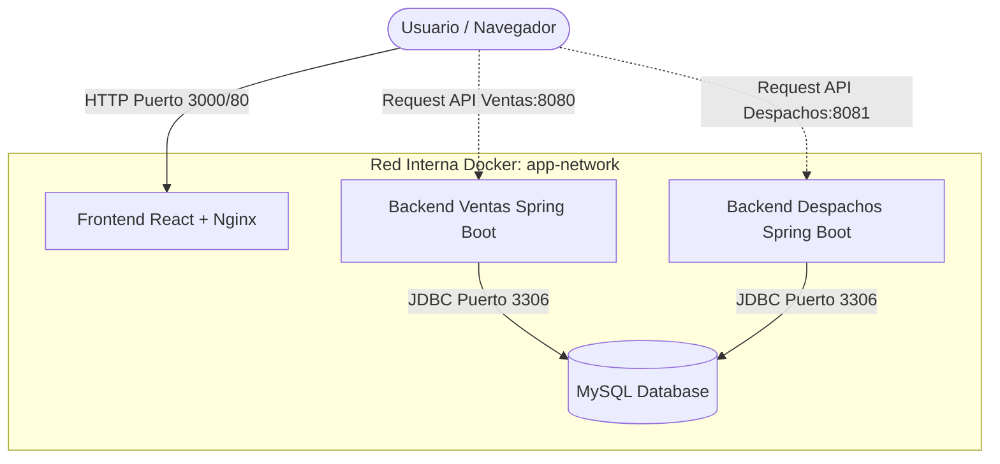
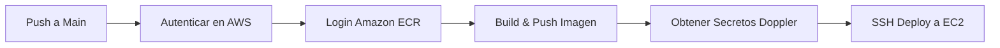

# Evaluación Final Transversal: DevOps & Contenerización

Este repositorio contiene la solución completa para la Evaluación Final Transversal de la asignatura **ISY1101 Introducción a Herramientas DevOps**. El proyecto consiste en la contenerización, orquestación y automatización del ciclo de integración y entrega continua (CI/CD) de una plataforma de ventas y despachos compuesta por tres servicios principales: un frontend en React, dos APIs de backend en Spring Boot y una base de datos relacional MySQL.

---

## 🛠️ Arquitectura del Sistema e Integración

El sistema está diseñado bajo una arquitectura de microservicios contenerizados y desacoplados. La comunicación entre componentes se realiza de la siguiente manera:



### Flujo de Comunicación:
1. **Frontend (React + Nginx):** Corre en el navegador del cliente. Realiza peticiones HTTP asíncronas (usando Axios) directamente a los endpoints expuestos por los backends. Las URLs de conexión están desacopladas en variables de entorno de Vite (`VITE_API_VENTAS_URL` y `VITE_API_DESPACHOS_URL`).
2. **Backends (Spring Boot):** Exponen controladores REST API en los puertos `8080` (Ventas) y `8081` (Despachos) con CORS habilitado (`@CrossOrigin(origins = "*")`) para permitir peticiones desde el origen del navegador.
3. **Base de Datos (MySQL):** Los backends se conectan utilizando la URL JDBC `jdbc:mysql://${DB_ENDPOINT}:${DB_PORT}/${DB_NAME}`. Hibernate genera automáticamente las tablas en base a las entidades en el inicio (`spring.jpa.hibernate.ddl-auto=update`).

---

## 📦 Contenerización y Buenas Prácticas

Cada componente se empaquetó de forma aislada siguiendo las mejores prácticas de la industria:

### 1. Dockerfiles Multietapa (Multi-stage Builds)
* **Backends (Ventas y Despachos):**
  * **Etapa 1 (Build):** Usa una imagen oficial `maven:3.8.5-openjdk-17-slim` para compilar el código fuente y empaquetar el `.jar` omitiendo los tests (`-DskipTests`) para acelerar la construcción y evitar acoplamientos con base de datos en frío.
  * **Etapa 2 (Run):** Usa `eclipse-temurin:17-jre-alpine` como base minimalista. Reduce drásticamente el tamaño final de la imagen a menos de 180MB.
  * **Seguridad:** Se crea un usuario de sistema y un grupo no-root (`spring`) para ejecutar el proceso de Java, mitigando riesgos de escalamiento de privilegios.
* **Frontend (React):**
  * **Etapa 1 (Build):** Usa `node:18-alpine` para la instalación de dependencias (`npm ci`) y compilación estática (`npm run build`). Recibe variables en tiempo de construcción (`ARG VITE_API_VENTAS_URL` y `VITE_API_DESPACHOS_URL`).
  * **Etapa 2 (Run):** Usa `nginx:alpine` para servir la compilación.
  * **Configuración:** Implementa un `nginx.conf` personalizado que redirige todas las peticiones a `index.html` (habilitando enrutamiento interno de React Router SPA).

### 2. Orquestación Local con Docker Compose
El archivo [docker-compose.yml](file:///c:/Users/bg144/Downloads/proyecto.semestral4/proyecto%20semestral/proyecto%20semestral/docker-compose.yml) permite levantar todo el entorno de desarrollo con un solo comando:
```yaml
docker-compose up --build
```
* **Redes:** Todos los servicios comparten una red interna tipo bridge (`app-network`).
* **Persistencia:** La base de datos MySQL utiliza un volumen mapeado (`mysql_data`) para mantener los registros persistentes entre reinicios.
* **Sincronización:** Se configuró un `healthcheck` en el servicio de MySQL para que los backends esperen (`depends_on.condition: service_healthy`) a que la base de datos esté lista para aceptar conexiones antes de iniciarse.

---

## 🚀 Pipeline de CI/CD (GitHub Actions)

El ciclo de Integración y Entrega Continua está completamente automatizado y desacoplado mediante workflows de GitHub Actions ubicados en `.github/workflows/`:
1. **[backend-despachos.yml](file:///c:/Users/bg144/Downloads/proyecto.semestral4/proyecto%20semestral/proyecto%20semestral/.github/workflows/backend-despachos.yml)**
2. **[backend-ventas.yml](file:///c:/Users/bg144/Downloads/proyecto.semestral4/proyecto%20semestral/proyecto%20semestral/.github/workflows/backend-ventas.yml)**
3. **[frontend.yml](file:///c:/Users/bg144/Downloads/proyecto.semestral4/proyecto%20semestral/proyecto%20semestral/.github/workflows/frontend.yml)**

### Flujo del Pipeline para todos los servicios:


* **Autenticación Segura:** Se utiliza la acción oficial `aws-actions/configure-aws-credentials` con las credenciales de tu cuenta de AWS.
* **Registro de Imágenes (Amazon ECR):** Las imágenes se envían con tag `:latest` y tags de ID de ejecución al registro privado de AWS ECR en **Norte de Virginia (`us-east-1`)**:
  * `${{ steps.login-ecr.outputs.registry }}/api_despachos:latest`
  * `${{ steps.login-ecr.outputs.registry }}/ventas_api:latest`
  * `${{ steps.login-ecr.outputs.registry }}/front_despacho:latest`
* **Despliegue Continuo (CD):** El pipeline se conecta mediante SSH (usando claves privadas) a la instancia de producción en EC2, autentica la máquina en el registro privado de ECR mediante un token seguro enviado al vuelo (`aws ecr get-login-password`), descarga la nueva imagen (`docker pull`) y arranca el contenedor con la configuración correspondiente. En el frontend, se pasan las URLs de backend dinámicamente obtenidas de Doppler como argumentos de construcción (`build-args`).

---

## 🛡️ Seguridad y Observabilidad en la Nube

### Seguridad de AWS (Principio de Mínimo Privilegio):
* **Gestión de Secretos:** Se utiliza **Doppler** como administrador centralizado de variables de entorno y **GitHub Secrets** para almacenar credenciales críticas de acceso a la nube (`AWS_ACCESS_KEY_ID`, `AWS_SECRET_ACCESS_KEY`, `AWS_SESSION_TOKEN`), evitando fugas de información.
* **Grupos de Seguridad (Security Groups):** Restringen el acceso externo de las instancias EC2:
  * Las APIs backend y base de datos no exponen puertos públicos excepto el puerto HTTP requerido por la aplicación.
  * El puerto `22` (SSH) está limitado para el acceso del pipeline de GitHub Actions o la IP del administrador.

### Observabilidad (Logs y Métricas):
* **Logs de Despliegue:** Disponibles de forma centralizada en la pestaña **Actions** de GitHub.
* **Logs y Métricas de AWS:** Las métricas de consumo de CPU, red y memoria de las instancias EC2 se recolectan en tiempo real mediante **AWS CloudWatch**, permitiendo alertas y monitoreo preventivo.

---

## 📈 Orquestación en Producción: ECS vs Despliegue Manual

> [!IMPORTANT]
> **Estado del Clúster en AWS (Listo para Demostración):**
> Se ha creado el clúster ECS `proyecto-semestral-cluster` en la región de **Norte de Virginia (`us-east-1`)** y se desplegaron los servicios bajo Fargate detrás de tu **Application Load Balancer (ALB)**:
> * **URL del Balanceador:** [http://semestral-alb-25385715.us-east-1.elb.amazonaws.com/](http://semestral-alb-25385715.us-east-1.elb.amazonaws.com/)
> * **Servicio Ventas:** `ventas-service-v2` (Puerto container 8080, ruta `/api/v1/ventas*`)
> * **Servicio Despachos:** `despachos-service-v2` (Puerto container 8081, ruta `/api/v1/despachos*`)
> * **Servicio Frontend:** `front-despacho-service-v2` (Puerto container 80, ruta `/*` por defecto)
>
> Esto te permite demostrar ante el docente la orquestación en caliente basada en ECS Fargate utilizando el balanceador de carga para ruteo de tráfico sin IPs fijas.

Para el despliegue final en producción en AWS, se recomienda utilizar **Amazon ECS (Elastic Container Service) con Fargate** en lugar de instancias EC2 independientes administradas manualmente:

| Criterio | Despliegue Manual (EC2) | Amazon ECS + AWS Fargate |
| :--- | :--- | :--- |
| **Administración** | Requiere configurar el SO, Docker, Docker Compose y dependencias manualmente. | Serverless, AWS gestiona la infraestructura subyacente de servidores. |
| **Escalabilidad** | Compleja y lenta. Requiere scripting manual o configuración de Auto Scaling Group a nivel SO. | Escalado automático nativo y rápido basado en CPU/Memoria o peticiones. |
| **Disponibilidad** | Si la instancia falla, la app cae. Requiere configurar Load Balancers manualmente. | Reemplazo automático de contenedores caídos (Self-healing) tras balanceador nativo (ALB). |
| **Seguridad** | Mayor superficie de ataque (requiere abrir puertos SSH, actualizar el sistema operativo). | Aislamiento completo a nivel de tarea, sin necesidad de puertos SSH. |

---

## 🧑‍💻 Cómo ejecutar localmente

1. Clona el repositorio:
   ```bash
   git clone https://github.com/bairon20/Examen.git
   cd Examen
   ```
2. Asegúrate de tener **Docker Desktop** iniciado.
3. Ejecuta el orquestador:
   ```bash
   docker-compose up --build
   ```
4. Acceso a los servicios en tu navegador:
   * **Frontend:** [http://localhost:3000](http://localhost:3000)
   * **Swagger API Ventas:** [http://localhost:8080/swagger-ui.html](http://localhost:8080/swagger-ui.html)
   * **Swagger API Despachos:** [http://localhost:8081/swagger-ui.html](http://localhost:8081/swagger-ui.html)
